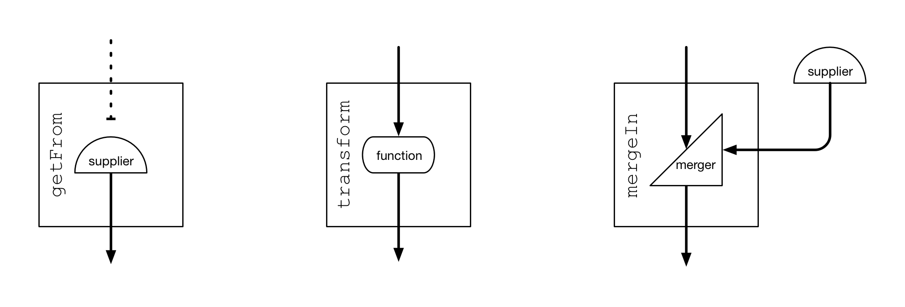
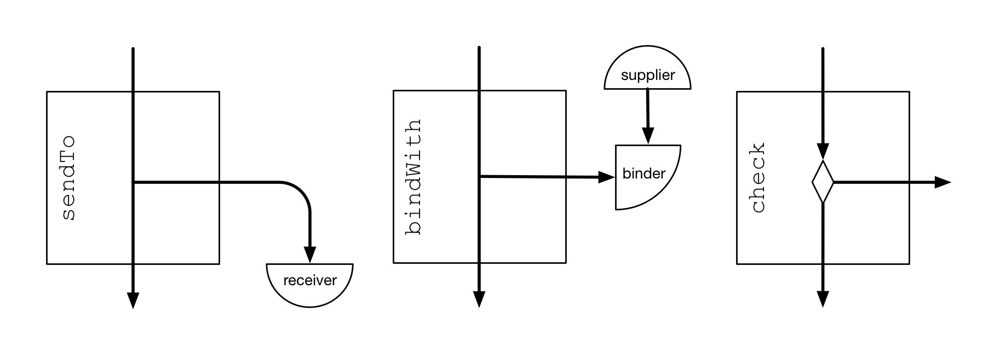

# Compiled repositories

复杂的repository可以用单个Java表达式编译出来。   
Java表达式由下面几部分构成，顺序如下：

```
// 声明RepositoryCompiler，并初始化，返回REventSource实例;
1. `Repositories.repositoryWithInitialValue(...)`;
// 指定事件源(Observable)，可以多个，返回RFrequency实例;
2. Event sources - `.observe(...)`;
// 设置通知频率(比如click频率限制)，返回RFlow实例;
3. Frequency of reaction - `.onUpdatesPer(...)` or `.onUpdatesPerLoop()`;
// 设置数据源(Supplier)，返回RFlow或RTermination实例;
4. Data processing flow - `.getFrom(...)`, `.mergeIn(...)`, `.transform(...)`, etc.;
// 其他配置，返回RConfig;
5. Miscellaneous configurations - `.notifyIf(...)`, `.onDeactivation(...)`, etc.;
// 编译成Repository实例。
6. `.compile()`.
```

当compiled repository运行时, 先将指定当事件源注册内部的updatable，同时启动数据处理流程来计算为首次准备的值。
当从事件源收到事件的时候，这个数据处理流程会再次启动来更新值以响应。

在第一次计算结果完成之前，repository将使用初始值(repositoryWithInitialValue()方法设置的初始值)作为数据。
当数据一旦有更新时，repository的观察者们都会收到通知。当不活动时，事件源将注销内部的updatable，数据处理流程不再运行，所以数据会变成旧的。重新活动后，数据会重新保持最新的。

The different stages of this expression are represented by the “compiler state interfaces” nested in 
`RepositoryCompilerStates`, 
表达式的不同阶段都返回`RepositoryCompilerStates`中内嵌的接口(compiler state interfaces)对象，这样可以每个阶段只暴露合适的方法, 引导开发者完成正确的表达式(使用IDE自动完成时)。

这些方法的完整文档可以在这些接口中找到；特别的部分：

* 事件源和响应频率: `RFrequency` 和 `REventSource`
* 数据处理流程: `RFlow` 和 `RSyncFlow`
* 其它配置: `RConfig`

repository编译表达式不能从中间断开，企图将中间结果存到本地变量或者强制转换(cast)为另一个接口，这些方法都不支持。

编译repository会导致一些开销, 但之后的操作相当轻量级。repository最适合与高级组件的生命周期进行绑定，例如Activity、可重用的视图或者一个为整个应用服务的全局单例。 

由于编译的开销，编译repository确实如此(还是会在运行时发生编译情况)。

## When, where, what

compiled repository表达式清晰的说明了什么时候(_when_)响应事件, 在什么线程(_where_)上响应事件, 提供什么数据(_what_)。
compiled repository指定的事件源和发生频率，这两个就是repository什么时候(_when_)响应事件的概念。

数据处理流程指定原数据(依赖)和计算出repository的数据，这就是repository提供什么数据(_what_)的概念。

由于内部使用了updatable, 必须在有Looper线程上被注册到事件源, compiled repository关联
_worker Looper_ (下一篇详细介绍 [Asynchronous programming](#asynchronous-programming))。

数据处理过程中，指令可以转交给Java执行器执行，这些明确的线程结构就是repository(_where_)的概念。

## Data processing flow

整个数据处理流程由指令组成，每一个指令接受一个输入值，并为下一条产生一个输出值。
第一条指令的输入值类型是repository的数据类型，最后一条指令也是输出相同类型的数据。
compiler状态接口使用泛型参数有助于保证类型安全，输入参数类型逆变性(Contravariance,下一条指令可以接受前一条产生的数据类型的父类)
和输出值类型协变性(Covariance,最后一条指令可以产生repository的数据类型的子类)

```
// 1. 协变性 (Covariance)： List<ASub> 是一个 List<A>，反之不成立
      
// 2. 逆变性 (Contravariance): List<A> 是一个 List<ASub>，反之不成立    
  
// 3. 不变性 (Invariance)：List<ASub> 不是一个 List<A>，List<A> 也不是一个 List<ASub>      
```

当数据处理流程开始运行, 
通过`Repository.get()`拉取的数据作为第一条指令的输入值。如果之前还没有更新过数据，拉取的数据可能是初始值或者使用`RepositoryConfig.RESET_TO_INITIAL_VALUE`重置的值。
这些指令顺序的执行转换输入值。
数据处理流程通常在运行完_then_指令后结束并产生一个终值或者使用终止语句(termination clause)(`RTermination`接口, 
详情在下面“Attempts and Result”中)结束流程并返回一个值，这种情况下repository数据值会更新并发送通知。
使用`.thenSkip()`指令或者终止语句(termination clause)也可以终止流程，跳过剩余的流程，这种情况下repository跳过数据更新、跳过发送通知。

## Operators

为了允许数据处理流程调用客户代码逻辑，Agera定制了下列只带有一个方法的接口：
* `Supplier.get()`: a 0-input, 1-output operator;
* `Function.apply(TFrom)`: a 1-input, 1-output operator;
* `Merger.merge(TFirst, TSecond)`: a 2-input, 1-output operator.

使用它们的指令是：
* `.getFrom(Supplier)` and variants;
* `.transform(Function)` and variants;
* `.mergeIn(Supplier, Merger)` and variants;  
如下图所示:



对于高级功能，数据处理流程提供了非线性操作符(数据从"侧边"流出，或者流程终止)，通过下列接口支持
* `Receiver.accept(T)`: a 1-input, 0-output operator;
* `Binder.bind(TFirst, TSecond)`: a 2-input, 0-output operator;
* `Predicate.apply(T)`: an operator that checks the input value for a yes-or-no answer.

使用它们的指令是：
* `.sendTo(Receiver)` and variants;
* `.bindWith(Supplier, Binder)` and variants;
* `.check(Predicate).or…` and variants;  
如下图所示:



为了帮助构建模块化的结构, `Repository` 实现了 `Supplier`接口, `MutableRepository` 实现了 `Supplier` 和 `Receiver`接口, 在复杂的repository中，它们可以直接当作操作符使用。

## Attempts and `Result`

这些函数式接口`Supplier`, `Function` and `Merger`都是不抛任何异常的, 但实践中，许多操作可能会失败。
为了捕获异常，Agera 提供了一个封装类 `Result`，它可以封装易失败操作的结果(成功或者失败)或者_attempt_的结果值。
_attempt_可以作为`Supplier`, `Function` 或 `Merger`的实现，返回`Result`。

数据处理流程提供能感知错误的指令，这样就可以在错误的情况下终止流程：

* `.attemptGetFrom(Supplier).or…`;
* `.attemptTransform(Function).or…`;
* `.attemptMergeIn(Supplier, Merger).or…`,

其中 `.or…` (和`.check`指令的第二部分相同)是终止语句，使用`RTermination`状态接口实现, 如前文所述, 可以跳过更新 (`.orSkip()`) 或 用计算的新值来结束数据流程(`.orEnd(Function)`)。

所有`.attempt*`指令保证下一条指令只接收成功的结果，使用输出`Result<T>`的操作符，输出一个能感知错误的结果`T`，而不是`Result<T>`。

```
    mRepository = Repositories.repositoryWithInitialValue(Result.<Integer>absent())
            .observe(mObservable)
            .onUpdatesPerLoop()
            // attemptGetFrom 输出 Result<Integer>
            .attemptGetFrom(new Supplier<Result<Integer>>() {
                @NonNull
                @Override
                public Result<Integer> get() {
                    return Result.success(100);
                }
            })
            .orSkip()
            // 输入 Integer
            .thenTransform(new Function<Integer, Result<Integer>>() {
                @NonNull
                @Override
                public Result<Integer> apply(@NonNull Integer input) {
                    return Result.success(input);
                }
            })
            .compile();
```

相反, 操作符也可以是恢复操作, 这意味着它需要`Result`作为输入, 或者是一个_attempt recovery_操作符，这意味着它输入和输出都是`Result`。
要把这样的操作符放在数据处理流程中， 前面的指令必须不是感知错误的(就算使用`.attempt*`操作符)，所以恢复操作符可以接受成功和失败的结果(`Result`类型)。

## Asynchronous programming

repository必须在有Looper的线程编译(通常是主线程)，这个Looper成为repository的[[worker looper|Observables-and-updatables#threading]], 所有这些过程都运行在这个Looper的线程上：

* 注册和注销 updatable；
* 观察、处理和事件源更新频率限制；
* 启动数据处理流程。

数据处理流程不要求在Looper线程上完全同步执行。专门的指令 `.goTo(Executor)` 和 `.goLazy()` 会开启异步执行。
它们不改变输入值；它们在运行时控制流程的持续：`.goTo(Executor)` 将剩下的执行指令发送到该Executor，
而 `.goLazy()` 暂停执行，直到需要新的数据的时候调用 `Repository.get()` 将继续执行剩下的执行。

在`.goTo(Executor)`指令之后， 线程将释放用于处理其他事件，repository可能同时发生被设为不活动状态和有更新事件。 
在后面这种情况下，数据处理流程会重新运行，为了减少竞争条件，不用启动一个并行线程，会运行在同一个线程中。
repository在不活动和并发更新是，可以取消正在执行的任务(ps:就是goTo()上执行的命令)，这样可以减少资源浪费(repository不活动的情况下)，
也可以更快的重新运行(并发更新的情况下，ps:因为只关心最新的数据嘛)。取消流程可以抑制更新repository数据和更新通知。 取消任务可以通过`.onDeactivation(int)` and `.onConcurrentUpdate(int)` 方法来设置, 定义在`RConfig`状态接口中。

在`.goLazy()`指令之后, 注册的观察者在任何情况下都会收到更新通知，但是是否真的更新数据取决于剩余的指令。
调用`Repository.get()`后会恢复同步执行，因为这个方法必须返回值，所有的取消都会忽略。
此外，如果Repository.get()调用之前，repository收到了更新通知，立即重启流程，暂停状态和保存的中间结果都会丢掉，剩余的指令也不会再运行。

调用`Repository.get()`后恢复指令执行到达`.goLazy()`之前，repository会返回之前的数据。`.goLazy()`可以跳过不必要的计算, 有策略地使用可以提高程序性能。